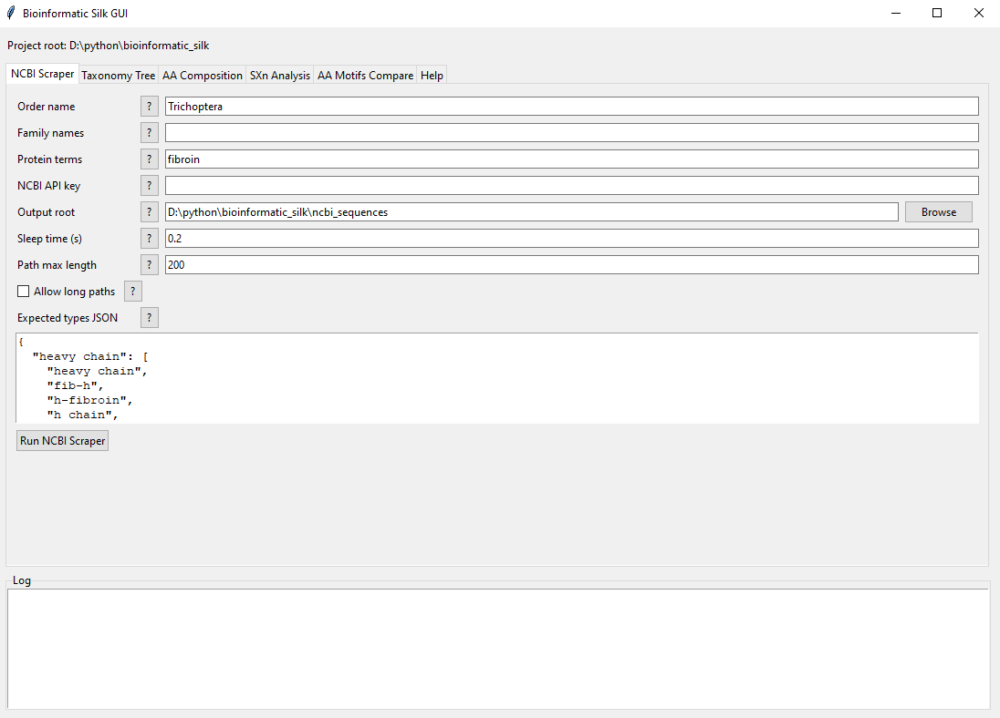
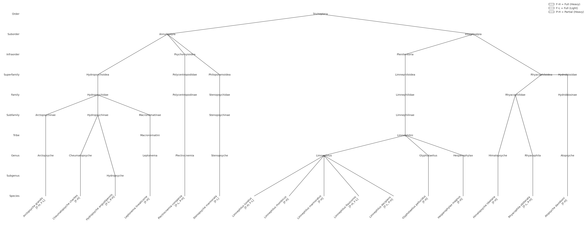
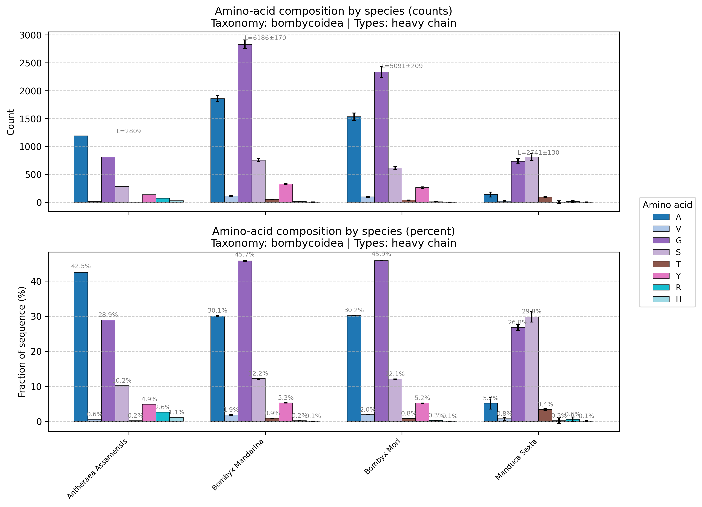
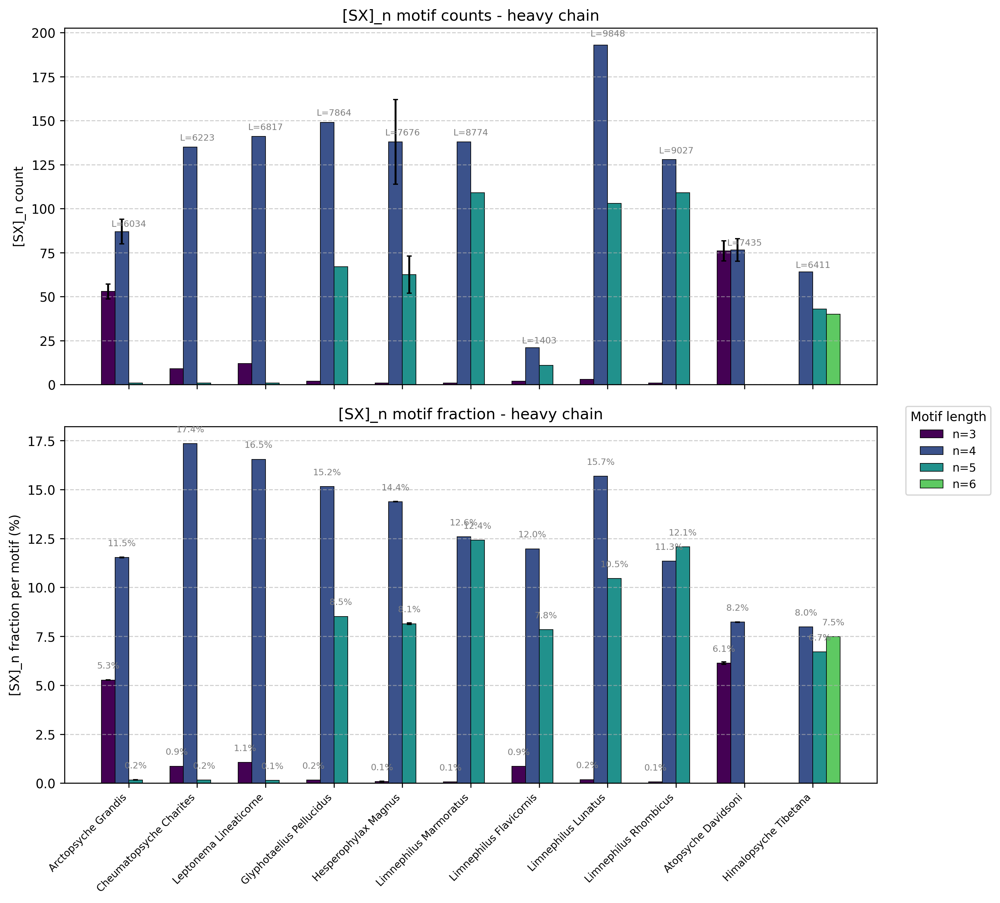
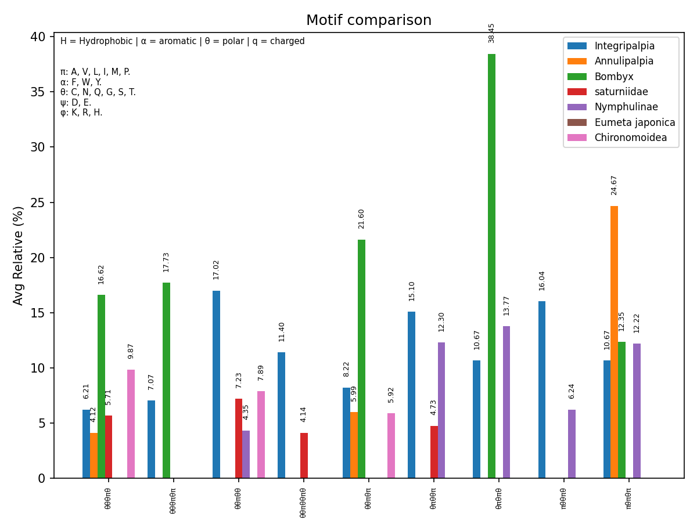

# Introduction

In the phylogenetic tree, there is an order called "Trichoptera" (caddisfly). 
Those insects living in the larva stage in fresh/creek waters, and in the adult stage they become moths.
My study focuses on them due to their special silk, which, in addition to the special properties of silk, including strength, extensibility, and toughness, is stable and adhesive in an aquatic environment.

Since there are many species of caddisfly, all producing silk with similar properties, it will be interesting to examine their amino acid composition and sequences to determine what features are essential for adhesive silk in an aquatic environment. 

For comparison, we will contrast these features with the silk of animals whose silk is not adhesive (negative control) and with those that produce adhesive silk (positive control).

Because available data on silk from aquatic animals is limited to a few species, each from a different order (Chironomus tepperi, Acentria ephemerella, and Argyroneta aquatica), the control will be based on terrestrial animals.

The analysis will involve examining the amino acid compositions of silks from species across different orders and searching for similar sequences and motifs among caddisfly species.
Those similarities are suspected to be related to their ability to produce adhesive silk in water. These findings will then be compared to sequences from other animals with known silk properties, such as silkworms, spiders, and bagworms.
Ultimately, this could help establish connections between sequences, amino acid composition, and the functional properties of the adhesive silk.

## Requriements

pls make sure you install the dependencies: ["requests","beautifulsoup4", "pandas", "numpy", "matplotlib"]

pls make sure you download the libraries folder

pls make sure you download the caddisfly, ants and moths folders.

**Using the GUI App**

Quick start:

1. Ensure you have Python 3 with Tkinter available.
2. Install Python packages: `requests`, `beautifulsoup4`, `pandas`, `numpy`, `matplotlib`.
3. From the termianl, run:

uv run ./gui_bioinformatic_silk.py

In case you didn't download caddissfly, ants, Diptera and moths folders, first action you should take in the application is dowloand your data set of interest. 

To do so, go to the NCBI scrapper tab and start from there.

## Code explanation 

The datasets of fibroin proteins are downloaded by the ncbi_scrapper file from the NCBI database for each order. 

The files were characterized based on the protein type (such as heavy chain), and whether the file was reported as "partial" or not.

The taxonomy of each species is saved in MD and JSON files, named phylo_tree.

The run_generate_species_index file generates an index from all the download data

The run_generate_taxonomy_graph file generates a phylogenetic tree. 

The aa_composition_analysis file generates plots of the interesting amino acid composition, and tables that contain the data.

The sxn_analysis_and_plotting file generates plots of [SX]n motifs' percentages in the sequences, as well as X-residue compositions and tables containing the data.

The aa_motifs_analysis file analyze the sequences of interest by charactization of amino acids, represent the sequences by the charactization and finds motifs in the 

represented sequences.

The compare_aa_group_motifs compare between represented sequences. 

The run_aa_motifs_and_compare is combination of aa_motifs_analysis and compare_aa_group_motifs

The codes utilize a fixed color map for each amino acid, ensuring that the X-residue composition graph and future plots use the same color for each amino acid. That will help with an easier understanding of the different plots.

For convenient, the ncbi_scrapper, run_generate_species_index, run_generate_taxonomy_graph, aa_composition_analysis, sxn_analysis_and_plotting, aa_motifs_analysis, compare_aa_group_motifs and run_aa_motifs_and_compare using libraries files that found in liberies folder.

A standard deviation has been calculated for cases where proteins of a species have more than one data file, and it is presented as error bars in the plots.

There is a filtering system for the file run_generate_taxonomy_graph (phylogenetic tree generation), sxn_analysis_and_plotting, aa_composition_analysis and run_aa_motifs_and_compare.

The filters are used to provide better control over presenting the data, resulting in more coherent, convenient, and understandable graphs. The specific filters are dependent on the graphs, since not all of them are relevant for all plots. 

## Output images

### Trichoptera taxonomy tree

### Bombycoidea amino acids composition

### Trichoptera SXn (n=3,4...50) analysis

### Trichoptera X -composition of SXn (n=3,4...50)

### motif comparison

#### minimun 3% comparison

#### minimun 4% comparison

